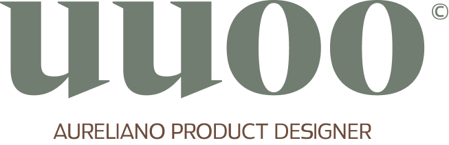

  
  <h1>Olá, eu sou o Aureliano 👋</h1>

---

Sou **Product Designer** focado em criar produtos digitais memoráveis. Acredito que o design bom é design funcional — aquele que, ao mesmo tempo que utiliza a psicologia para antecipar necessidades, garante uma navegação fluida onde o usuário encontra o que precisa sem complicações.

Meu compromisso é com a retenção, a satisfação e a criação de experiências que não apenas funcionam, mas fazem as pessoas voltarem.

---
### 📊 GitHub Stats

---

### 🧠 Minha Filosofia de Design
*   **Design Robusto:** Entender o comportamento humano é o caminho para antecipar necessidades. Para mim, o usuário SEMPRE é o centro de tudo.
*   **Além do Figma:** Minha força está na articulação entre times e stakeholders. Sou transparente com prazos e metas, garantindo que o projeto funcione na prática.
*   **Pesquisa Real:** Preencho o vazio de dados no mercado entregando insights que provam o que o cliente realmente precisa, reduzindo custos e aumentando a precisão do produto.

### 🛠 Skills & Stack
*   **Design Estratégico:** Product Design, UX Research, Prototipagem de Alta Fidelidade, Design Systems.
*   **Fundamentos:** Psicologia do Design, Heurísticas de UX, Acessibilidade Universal.
*   **Tech Stack:** Atualmente integrando design e front-end com **HTML, CSS, Tailwind e React**, garantindo que a visão de design seja executada com precisão técnica.

### 📈 O que você pode esperar do meu trabalho?
> *"Fazer as pessoas voltarem é o que torna um design excelente."*

Não trabalho sozinho. Acredito que um projeto forte exige colaboração, comunicação clara e a tradução constante de dados em soluções visuais que impactam o negócio e o usuário final.

---

### 🚀 Minhas Ferramentas

  
  
  
  
  

### 🌐 Vamos conectar?
Estou sempre aberto a trocar experiências sobre design, dados e o desenvolvimento de produtos digitais.

*   **Portfólio:** [https://auurelianoo.com.br/](https://auurelianoo.com.br/)
*   **LinkedIn:** [https://www.linkedin.com/in/auurelianoo/](https://www.linkedin.com/in/auurelianoo/)

---
*Design: [uuoo] | Product Design focado em resultados e pessoas.*
